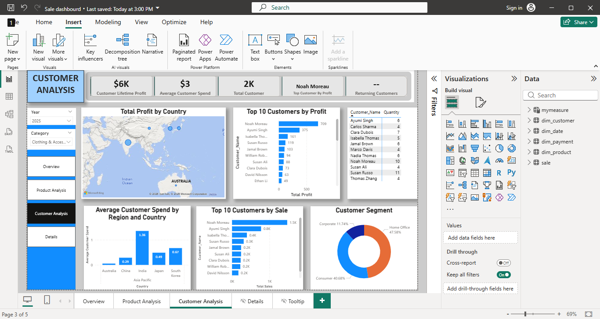

# Sales & Customer Performance Analytics Dashboard | Power BI + MySQL

A comprehensive interactive business intelligence solution built with Power BI and MySQL to analyze revenue, profitability, product performance, and customer behavior. The project transforms raw sales transaction data into actionable business insights through SQL data transformation, star schema modeling, DAX calculations, and interactive dashboards.

---

# 📊 Dashboard Preview

### Executive Overview


### Product Analysis


### Customer Analysis

 

---

# 📋 Project Overview

This analytics solution consolidates commercial sales data into three core analytical perspectives:

### Executive Overview

Provides a high-level view of business performance through:

* Total Sales
* Total Profit
* Profit Margin
* Total Orders
* Total Quantity Sold
* Sales trends over time
* Category performance
* Payment method analysis

### Product Analysis

Provides detailed product performance insights through:

* Top 10 Products by Profit
* Top 10 Products by Sales
* Top 10 Products by Quantity Sold
* Bottom 10 Products by Profit
* Bottom 10 Products by Sales
* Bottom 10 Products by Quantity Sold
* Product category comparison
* Profitability analysis

### Customer Analysis

Provides customer-focused insights through:

* Customer Lifetime Profit
* Customer contribution analysis
* Customer segment analysis
* High-value customer identification
* Customer purchasing behavior

---

# 🛠️ Tech Stack & Architecture

| Component             | Technology               |
| --------------------- | ------------------------ |
| Database Storage      | MySQL Server             |
| Data Transformation   | SQL                      |
| Database Connectivity | MySQL ODBC Driver        |
| Analytics Platform    | Power BI Desktop         |
| Data Modeling         | Star Schema Architecture |
| Calculation Layer     | DAX                      |

---

# 🔄 Data Connection & ETL Workflow

The project follows an end-to-end business intelligence workflow:

```text
Raw Sales Data
       |
       ▼
MySQL Database
       |
       ▼
SQL Transformation
(Data Cleaning & Normalization)
       |
       ▼
Star Schema Model
(Fact & Dimension Tables)
       |
       ▼
MySQL ODBC Connection
       |
       ▼
Power BI Data Model
       |
       ▼
Interactive Dashboard
```

## Data Storage

The raw sales dataset was imported and stored in MySQL Server, providing a centralized relational database environment for analysis.

## SQL Transformation & Data Modeling

SQL was used to:

* Clean and validate data
* Remove duplicates
* Create dimension tables
* Create primary and foreign keys
* Establish relationships
* Prepare data for analytical reporting

The dataset was transformed into a Star Schema Architecture to improve performance and simplify reporting.

## Power BI Integration

Power BI Desktop was connected to MySQL using the MySQL ODBC Connector.

The transformed tables were imported into Power BI where:

* Relationships were configured
* DAX measures were created
* Interactive reports were developed

---

# 🗂️ Data Model Structure

The semantic model uses a Star Schema Architecture.

### Fact Table

#### sale

Contains transactional measures including:

* Order ID
* Product ID
* Customer ID
* Date ID
* Quantity
* Sales Amount
* Profit
* Discount
* Shipping Cost

### Dimension Tables

#### dim_customer

Contains:

* Customer ID
* Customer Name
* Customer Segment

#### dim_product

Contains:

* Product ID
* Product Name
* Product Category

#### dim_date

Contains:

* Date
* Month
* Year
* Month Number

#### dim_payment

Contains:

* Payment Method

---

# ⚙️ Core DAX Measures

### Total Sales

```DAX
Total Sales = SUM(sale[Total_Sales])
```

### Total Profit

```DAX
Total Profit = SUM(sale[Profit])
```

### Profit Margin %

```DAX
Profit Margin % =
DIVIDE(
    [Total Profit],
    [Total Sales],
    0
)
```

### Total Orders

```DAX
Total Orders =
DISTINCTCOUNT(sale[Order_ID])
```

---

# 🚀 Key Dashboard Features

## Executive Overview

* KPI summary cards
* Sales trend analysis
* Category performance analysis
* Payment method breakdown
* Interactive slicers

## Product Analysis

* Top 10 Products by Profit
* Top 10 Products by Sales
* Top 10 Products by Quantity Sold
* Bottom 10 Products by Profit
* Bottom 10 Products by Sales
* Bottom 10 Products by Quantity Sold
* Product ranking analysis
* Profitability comparison

## Customer Analysis

* Customer Lifetime Profit
* Customer contribution ranking
* Segment analysis
* Customer performance evaluation

---

# 🔍 Advanced Interactivity

## Drillthrough

A dedicated Details page was configured using Power BI Drillthrough functionality.

Users can:

* Right-click a product or customer
* Navigate to detailed transaction-level information
* Maintain filter context using Keep All Filters

This enables detailed investigation without cluttering the primary report pages.

## Custom Report Page Tooltips

Custom tooltip pages provide additional context when users hover over report visuals.

Tooltips display:

* Additional performance metrics
* Product-level details
* Customer-level insights
* Supporting visual context

This improves the user experience while maintaining a clean dashboard layout.

---

# 📖 Data Storytelling Approach

The dashboard was designed using a business storytelling approach, guiding users from high-level performance monitoring to detailed operational analysis.

Instead of presenting only charts and numbers, the report follows a structured analytical journey.

## 1. Executive Overview – What is happening?

The first page provides leadership with a quick understanding of overall business performance.

Key questions answered:

* How much revenue has the business generated?
* How profitable is the business?
* How are sales performing over time?
* Which categories contribute the most value?

## 2. Product Analysis – Why is performance changing?

The second page moves from business results into product-level investigation.

Key questions answered:

* Which products generate the highest profit?
* Which products drive sales volume?
* Which products underperform?
* What are the Top 10 and Bottom 10 products by profit, sales, and quantity sold?
* Are high-sales products also highly profitable?

## 3. Customer Analysis – Who creates business value?

The customer analysis page focuses on customer contribution.

Key questions answered:

* Which customers generate the most profit?
* Which customer segments provide the highest value?
* How much value does each customer contribute?

## 4. Interactive Exploration – Find the details behind the numbers

Users can investigate insights further through:

* Drillthrough pages
* Custom tooltips
* Dynamic slicers and filters

The report structure follows a natural analytical flow:

**Business Performance → Product Drivers → Customer Value → Detailed Investigation**

This approach transforms the dashboard from a reporting tool into a decision-support solution.

---

# 🎯 Project Outcome

This project demonstrates practical skills in:

* SQL Data Transformation
* MySQL Database Management
* Star Schema Data Modeling
* ODBC Connectivity
* Power BI Development
* DAX Calculations
* Business Intelligence Reporting
* Dashboard Design
* Data Storytelling

---

# 👤 Author

**Jakuaterua Kaitjindi**

Data Analyst Portfolio Project
